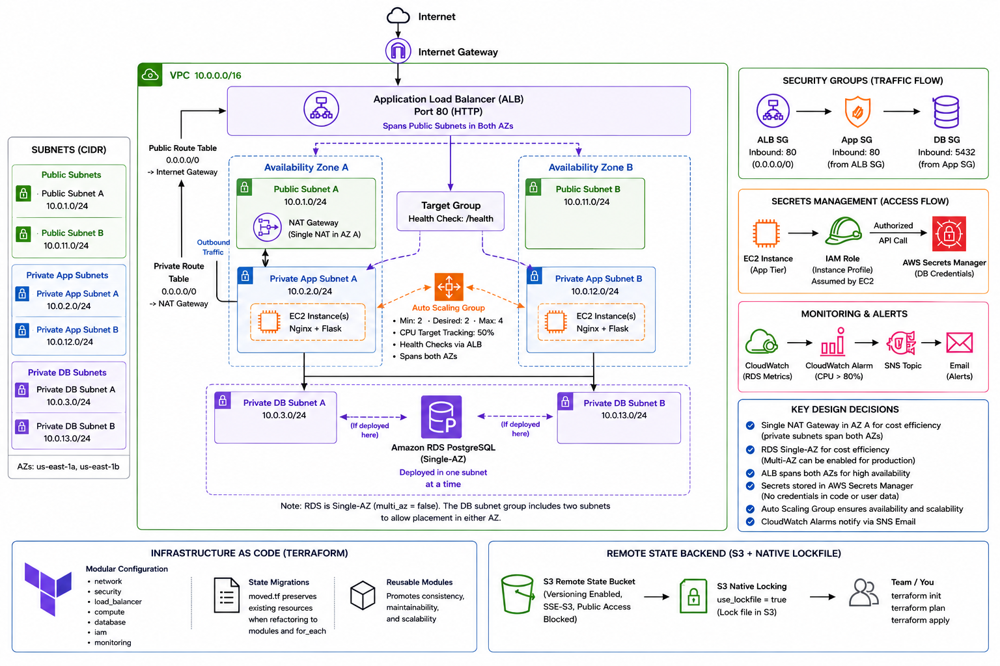

# Terraform Three-Tier AWS Architecture

A modular Terraform deployment of a highly available three-tier AWS application using an Application Load Balancer, Auto Scaling, Amazon RDS PostgreSQL, AWS Secrets Manager, CloudWatch, SNS, and S3 remote state.

This project is the Infrastructure as Code evolution of an architecture I originally built manually in the AWS Management Console. After understanding how the individual AWS services interacted, I rebuilt the environment with Terraform and progressively refactored the configuration into reusable modules.

The project demonstrates not only AWS infrastructure design, but also Terraform state management, dependency management, modularization, infrastructure refactoring, automated application bootstrapping, monitoring, and security.

---

## Architecture



The infrastructure follows a three-tier design distributed across two Availability Zones.

```text
                         Internet
                            |
                     Internet Gateway
                            |
                 Application Load Balancer
                    /                 \
                   /                   \
          Public Subnet A        Public Subnet B
             us-east-1a             us-east-1b
                   \                   /
                    \                 /
                     Target Group
                          |
                   Auto Scaling Group
                    /             \
                   /               \
           EC2 Instance         EC2 Instance
         Private App A         Private App B
             |                     |
             +----------+----------+
                        |
                 RDS PostgreSQL
                  Private DB Tier
```

The Application Load Balancer is the only application component directly accessible from the internet. EC2 instances and the PostgreSQL database remain in private subnets.

---

## Project Evolution

I intentionally developed this project in stages.

### 1. Manual AWS Deployment

I first built the architecture manually through the AWS Management Console to understand how the individual components interact.

This included configuring:

- VPC networking
- Public and private subnets
- Route tables
- Internet Gateway
- NAT Gateway
- Security Groups
- Application Load Balancer
- Target Groups
- EC2 instances
- Auto Scaling
- Amazon RDS
- IAM
- Secrets Manager
- CloudWatch
- SNS

Building the environment manually helped establish a practical understanding of the traffic flows, dependencies, security boundaries, and failure points within the architecture.

### 2. Terraform Reconstruction

I then rebuilt the infrastructure using Terraform.

The initial Terraform configuration used individually declared resources. As the project evolved, the infrastructure was progressively refactored into reusable modules.

### 3. State-Aware Refactoring

Rather than destroying the existing infrastructure and recreating it after each refactor, I migrated Terraform resource addresses using `moved` blocks.

This allowed the configuration to evolve from root-level resources into modules and from individually declared resources into `for_each`-managed resources without unnecessarily recreating live AWS infrastructure.

Before applying major refactors, I verified that Terraform produced:

```text
0 to add, 0 to change, 0 to destroy
```

This process reinforced the importance of understanding Terraform state rather than treating Terraform only as a resource creation tool.

---

# AWS Services Used

| Service | Purpose |
|---|---|
| Amazon VPC | Provides network isolation for the infrastructure |
| Amazon EC2 | Runs the Flask web application |
| Application Load Balancer | Distributes incoming HTTP traffic |
| EC2 Auto Scaling | Maintains application availability and scales capacity |
| Amazon RDS PostgreSQL | Managed relational database |
| AWS Secrets Manager | Stores database credentials |
| AWS IAM | Provides EC2 permission to retrieve secrets |
| Amazon CloudWatch | Monitors infrastructure metrics |
| Amazon SNS | Sends infrastructure alarm notifications |
| Amazon S3 | Stores Terraform remote state |
| NAT Gateway | Provides outbound internet access for private application instances |
| Internet Gateway | Provides internet connectivity for public resources |

---

# Terraform Module Structure

The Terraform configuration is separated into modules based on infrastructure responsibility.

```text
terraform-three-tier-architecture/
│
├── bootstrap/
│   └── main.tf
│
├── modules/
│   ├── network/
│   │   ├── main.tf
│   │   ├── variables.tf
│   │   └── outputs.tf
│   │
│   ├── security/
│   │   ├── main.tf
│   │   ├── variables.tf
│   │   └── outputs.tf
│   │
│   ├── database/
│   │   ├── main.tf
│   │   ├── variables.tf
│   │   └── outputs.tf
│   │
│   ├── iam/
│   │   ├── main.tf
│   │   ├── variables.tf
│   │   └── outputs.tf
│   │
│   ├── compute/
│   │   ├── main.tf
│   │   ├── variables.tf
│   │   └── templates/
│   │       └── user-data.sh.tftpl
│   │
│   ├── load_balancer/
│   │   ├── main.tf
│   │   ├── variables.tf
│   │   └── outputs.tf
│   │
│   └── monitoring/
│       ├── main.tf
│       └── variables.tf
│
├── compute.tf
├── database.tf
├── iam.tf
├── load_balancer.tf
├── locals.tf
├── monitoring.tf
├── moved.tf
├── network.tf
├── outputs.tf
├── security.tf
├── variables.tf
├── versions.tf
├── terraform.tfvars.example
└── .gitignore
```

Each module exposes only the outputs required by other infrastructure components.

For example:

```text
Network Module
      |
      | subnet IDs / VPC ID
      v
Security Module
      |
      | security group IDs
      v
Compute / Database / Load Balancer
```

This creates explicit interfaces between infrastructure components rather than tightly coupling resources together.

---

# Networking Design

The infrastructure uses a custom VPC:

```text
10.0.0.0/16
```

Six subnets are distributed across two Availability Zones.

| Subnet | CIDR | Availability Zone | Purpose |
|---|---|---|---|
| Public A | `10.0.1.0/24` | `us-east-1a` | ALB / NAT Gateway |
| Public B | `10.0.11.0/24` | `us-east-1b` | ALB |
| Private App A | `10.0.2.0/24` | `us-east-1a` | EC2 application instances |
| Private App B | `10.0.12.0/24` | `us-east-1b` | EC2 application instances |
| Private DB A | `10.0.3.0/24` | `us-east-1a` | RDS DB subnet group |
| Private DB B | `10.0.13.0/24` | `us-east-1b` | RDS DB subnet group |

## Public Routing

The public route table sends internet-bound traffic to the Internet Gateway.

```text
0.0.0.0/0
     |
     v
Internet Gateway
```

## Private Routing

Application instances do not receive public IP addresses.

Outbound internet traffic from the private application tier follows:

```text
EC2
 |
 v
Private Route Table
 |
 | 0.0.0.0/0
 v
NAT Gateway
 |
 v
Internet Gateway
 |
 v
Internet
```

The NAT Gateway is used only for outbound connectivity from private resources.

It is not part of the inbound application request path.

Inbound application traffic follows:

```text
Internet
   |
   v
Internet Gateway
   |
   v
Application Load Balancer
   |
   v
Private EC2 Instances
```

---

# Security Design

The application uses Security Group referencing rather than exposing internal resources using broad CIDR rules.

## ALB Security Group

Allows:

```text
TCP 80
Source: 0.0.0.0/0
```

The ALB is the public entry point into the application.

## Application Security Group

Allows:

```text
TCP 80
Source: ALB Security Group
```

The EC2 application instances therefore accept application traffic only from resources associated with the ALB Security Group.

## Database Security Group

Allows:

```text
TCP 5432
Source: Application Security Group
```

The database accepts PostgreSQL connections only from the application tier.

The resulting security chain is:

```text
Internet
   |
   | HTTP :80
   v
ALB Security Group
   |
   | HTTP :80
   v
Application Security Group
   |
   | PostgreSQL :5432
   v
Database Security Group
```

This prevents direct internet access to both the EC2 instances and the database.

---

# Application Architecture

The EC2 instances run a small Python/Flask application backed by PostgreSQL.

The application stack consists of:

- Nginx
- Python
- Flask
- boto3
- psycopg2
- PostgreSQL

The complete application request path is:

```text
Browser
   |
   v
Application Load Balancer
   |
   v
Nginx :80
   |
   v
Flask :8080
   |
   +-----------------------+
   |                       |
   v                       v
AWS Secrets Manager    PostgreSQL
   |                       |
   | credentials           | SQL query
   +-----------> Flask <----+
                    |
                    v
                 HTML
                    |
                    v
                  User
```

Nginx acts as the web server and reverse proxy.

Flask contains the application logic.

`boto3` allows the Python application to interact with AWS APIs.

`psycopg2` provides the PostgreSQL connection between Python and Amazon RDS.

---

# Automated EC2 Bootstrapping

Application instances are automatically configured using Launch Template User Data.

Terraform renders the bootstrap script using `templatefile()` and passes infrastructure-specific values into the template.

The bootstrap process:

1. Installs Nginx
2. Installs Python dependencies
3. Installs Flask
4. Installs boto3
5. Installs the PostgreSQL Python driver
6. Creates the Flask application
7. Configures a systemd service
8. Configures Nginx as a reverse proxy
9. Starts the application services

This allows instances launched by the Auto Scaling Group to configure themselves automatically rather than requiring manual SSH configuration.

---

# Secrets Management

Database credentials are not hard-coded into the application or Terraform configuration.

Terraform generates the database password and stores the database connection information in AWS Secrets Manager.

The EC2 instances receive an IAM instance profile that allows:

```text
secretsmanager:GetSecretValue
```

for the application secret.

At runtime:

```text
EC2 Instance
     |
     | assumes IAM role
     v
IAM Instance Profile
     |
     | authorizes API request
     v
AWS Secrets Manager
     |
     | database credentials
     v
Flask Application
     |
     v
RDS PostgreSQL
```

The application retrieves the credentials only when they are required.

---

# High Availability and Auto Scaling

The application tier runs inside an EC2 Auto Scaling Group distributed across two private application subnets.

The Auto Scaling configuration uses:

```text
Minimum capacity: 2
Desired capacity: 2
Maximum capacity: 4
```

The Auto Scaling Group is attached directly to the Application Load Balancer target group.

## Health Checks

The Flask application exposes:

```text
/health
```

The endpoint returns a successful response without querying the database.

This provides a lightweight application health check for the load balancer.

The Auto Scaling Group uses ELB health checks, allowing unhealthy application instances to be replaced automatically.

## Target Tracking Scaling

A target tracking policy monitors average CPU utilization.

Target:

```text
50% CPU utilization
```

If demand increases, the Auto Scaling Group can increase application capacity up to its configured maximum.

Terraform intentionally ignores changes to `desired_capacity`:

```hcl
lifecycle {
  ignore_changes = [desired_capacity]
}
```

This prevents a later Terraform deployment from automatically resetting capacity changes made by the Auto Scaling service.

---

# Database Architecture

Amazon RDS runs PostgreSQL inside the private database tier.

The database configuration includes:

- PostgreSQL 17
- `db.t3.micro`
- 20 GB gp3 storage
- Storage encryption
- Maximum storage autoscaling threshold of 100 GB
- Private network access
- DB subnet group spanning two Availability Zones
- Secrets Manager integration

The RDS instance itself is configured as:

```text
Multi-AZ: false
```

The DB subnet group spans multiple Availability Zones, but this does **not** make the database Multi-AZ.

For this lab environment, a Single-AZ deployment was intentionally used to reduce cost.

A production implementation would enable Multi-AZ RDS for database-level high availability.

---

# Monitoring and Alerting

Amazon CloudWatch monitors infrastructure health.

The project includes an RDS CPU utilization alarm.

Configuration:

```text
Metric: CPUUtilization
Namespace: AWS/RDS
Statistic: Average
Period: 300 seconds
Evaluation periods: 2
Threshold: > 80%
```

When the threshold is breached:

```text
RDS
 |
 | CPUUtilization
 v
CloudWatch
 |
 | Alarm
 v
SNS Topic
 |
 v
Email Notification
```

This provides a basic infrastructure alerting pipeline that can be expanded with additional metrics in a production environment.

---

# Remote Terraform State

Terraform state is stored remotely in Amazon S3 rather than only on the local workstation.

The backend uses:

```hcl
backend "s3" {
  key          = "three-tier-app/terraform.tfstate"
  region       = "us-east-1"
  encrypt      = true
  use_lockfile = true
}
```

The S3 bucket is configured with:

- Versioning
- Server-side encryption
- Public access blocking

Terraform uses S3 native state locking through:

```hcl
use_lockfile = true
```

No DynamoDB state-locking table is required by this project.

## Bootstrap Configuration

Because Terraform cannot use an S3 backend before the backend bucket exists, the project includes a separate `bootstrap/` configuration.

The bootstrap configuration creates the state bucket first.

The main Terraform configuration can then initialize against the remote backend.

---

# Terraform State Refactoring

One of the primary learning objectives of this project was understanding how Terraform state behaves during infrastructure refactoring.

The infrastructure originally contained root-level resources.

Those resources were later moved into modules such as:

```text
modules/network
modules/security
modules/database
modules/iam
modules/compute
modules/load_balancer
modules/monitoring
```

Network resources were also refactored from individually declared resources into map-driven `for_each` resources.

Terraform `moved` blocks preserve the relationship between the old and new resource addresses.

Conceptually:

```text
Old Terraform Address
        |
        | moved {}
        v
New Module Address
        |
        v
Same AWS Resource
```

This allowed the Terraform codebase to be reorganized without unnecessarily destroying and recreating the underlying AWS infrastructure.

The historical migrations remain in `moved.tf` to document how the infrastructure evolved.

---

# Terraform Concepts Demonstrated

This project demonstrates practical use of:

### Infrastructure as Code

AWS infrastructure is defined declaratively using Terraform.

### Modules

Infrastructure is separated into reusable logical components.

### Variables

Configuration values are parameterized rather than duplicated throughout the codebase.

### Outputs

Modules expose required resource attributes to other parts of the infrastructure.

### Locals

Local values simplify repeated configuration and resource maps.

### `for_each`

Multiple related resources such as subnets and route table associations are created from structured collections.

### Data Sources

Terraform discovers existing AWS information such as the appropriate Amazon Linux AMI.

### Resource Dependencies

References between Terraform resources create an implicit dependency graph.

### Lifecycle Rules

Lifecycle configuration controls how Terraform handles resource replacement and externally managed values.

### Remote State

Terraform state is stored in encrypted, versioned S3 storage.

### State Locking

S3 native locking protects the state from concurrent modification.

### `moved` Blocks

Existing infrastructure can be safely refactored to new Terraform addresses.

### Template Rendering

`templatefile()` injects Terraform values into EC2 bootstrap scripts.

---

# Challenges and Troubleshooting

A significant part of this project involved diagnosing infrastructure problems rather than simply creating resources.

## NAT Gateway and Private Routing

### Problem

Private EC2 instances initially lacked outbound internet connectivity.

### Investigation

I reviewed:

- NAT Gateway configuration
- Elastic IP association
- Private route tables
- Default routes
- Route table associations

### Resolution

The NAT Gateway was correctly created in a public subnet with an Elastic IP, and the private route table was configured with:

```text
0.0.0.0/0 -> NAT Gateway
```

This reinforced the difference between inbound application traffic and outbound private subnet traffic.

---

## PostgreSQL Connectivity Timeout

### Problem

The application tier could resolve the RDS endpoint but could not establish a PostgreSQL connection.

### Investigation

DNS resolution confirmed that the RDS endpoint resolved to a private IP address.

Port connectivity testing showed that TCP port `5432` was not initially reachable.

### Root Cause

The database Security Group allowed the wrong source.

### Resolution

The database Security Group was changed to allow:

```text
TCP 5432
Source: Application Security Group
```

rather than allowing access based on a public IP address.

This reinforced that communication between AWS resources should generally use their private network paths and Security Group relationships.

---

## IAM Role Missing From New Instances

### Problem

Replacement EC2 instances launched by the Auto Scaling Group could not retrieve the database secret.

### Root Cause

A newer Launch Template version had been created from an older template version that did not include the IAM instance profile.

### Resolution

The Launch Template configuration was corrected so newly launched instances received the required IAM role.

This demonstrated the importance of understanding Launch Template versioning when Auto Scaling Groups create replacement instances.

---

## Flask Port Conflict

### Problem

The systemd-managed Flask service failed to start.

### Investigation

Service logs and socket inspection showed:

```text
Address already in use
```

### Root Cause

A manually started Flask process was already listening on port `8080`.

### Resolution

The conflicting process was removed and application lifecycle management was left to systemd.

This reinforced the value of using:

- `journalctl`
- process inspection
- socket/port inspection
- systemd

when troubleshooting Linux application services.

---

## Terraform Refactoring Plans Showing Destruction

### Problem

During Terraform modularization, some plans unexpectedly showed resources being destroyed and recreated.

### Investigation

Terraform state addresses were compared with the new module addresses.

In one case, a `moved.tf` change had not been saved before running the plan.

In another, route table resources had accidentally disappeared from the active configuration.

### Resolution

The configuration was corrected before applying any destructive plan.

Major refactors were not applied until Terraform returned:

```text
0 to add, 0 to change, 0 to destroy
```

This became one of the most important lessons from the project:

> A Terraform plan should be understood before it is applied.

---

# Design Decisions

Several infrastructure decisions were intentionally made to balance architecture learning with the cost of running a personal lab.

## Single NAT Gateway

The architecture uses one NAT Gateway rather than one per Availability Zone.

This reduces lab cost but introduces a single point of failure for private outbound connectivity.

A production architecture would typically deploy a NAT Gateway in each Availability Zone and route each private subnet to the NAT Gateway in its own AZ.

## Single-AZ RDS

The DB subnet group spans two Availability Zones, but the RDS instance itself is Single-AZ.

This reduces lab cost.

Production infrastructure would enable Multi-AZ RDS.

## HTTP Instead of HTTPS

The current Application Load Balancer uses HTTP on port 80.

HTTPS was not implemented because this project does not currently use a custom domain.

A production deployment would use:

```text
Route 53 / DNS
       |
       v
Application Load Balancer
       |
       | HTTPS :443
       v
ACM Certificate
```

HTTP traffic could then be redirected to HTTPS.

---

# Production Improvements

If this architecture were moved toward production, I would consider:

- Enable HTTPS using AWS Certificate Manager
- Configure a custom domain and DNS
- Redirect HTTP traffic to HTTPS
- Deploy one NAT Gateway per Availability Zone
- Enable Multi-AZ RDS
- Increase RDS backup retention
- Enable database deletion protection
- Use final RDS snapshots
- Expand CloudWatch alarms
- Add application-level monitoring and centralized logging
- Evaluate AWS WAF for public application protection
- Further restrict outbound Security Group rules
- Add CI/CD validation for Terraform changes

These are intentionally not implemented in the current project to keep the environment focused and cost-conscious.

---

# Deployment

## Prerequisites

Before deploying, install:

- Terraform
- AWS CLI
- Git

You also need an AWS account and AWS credentials configured locally.

Do **not** store AWS access keys inside Terraform files or commit credentials to Git.

---

## 1. Clone the Repository

```bash
git clone https://github.com/javiousj234/terraform-three-tier-architecture.git
cd terraform-three-tier-architecture
```

---

## 2. Configure Terraform Variables

Copy the example variables file:

```bash
cp terraform.tfvars.example terraform.tfvars
```

Update the values as required for your environment.

The real `terraform.tfvars` file is excluded from Git.

---

## 3. Create the Remote State Infrastructure

Navigate to the bootstrap directory:

```bash
cd bootstrap
```

Initialize Terraform:

```bash
terraform init
```

Review the plan:

```bash
terraform plan
```

Create the state infrastructure:

```bash
terraform apply
```

Return to the project root:

```bash
cd ..
```

> S3 bucket names are globally unique. Update the backend/bootstrap bucket configuration to use a unique bucket name before deploying.

---

## 4. Initialize the Main Infrastructure

```bash
terraform init
```

If the backend configuration changed, Terraform may prompt for state migration or backend reconfiguration.

---

## 5. Format and Validate

```bash
terraform fmt -recursive
terraform validate
```

---

## 6. Review the Terraform Plan

```bash
terraform plan
```

Always inspect the proposed resource changes before applying them.

---

## 7. Deploy

```bash
terraform apply
```

Review the final plan and approve the deployment.

---

## 8. Confirm SNS Subscription

AWS SNS sends a confirmation email when the subscription is initially created.

The subscription must be confirmed before CloudWatch alarms can send email notifications.

---

## 9. Access the Application

After deployment, retrieve the Application Load Balancer DNS name from the Terraform outputs:

```bash
terraform output
```

Open the ALB DNS name in a browser.

The ALB forwards requests only to healthy EC2 targets.

---

# Cleanup

AWS resources in this project can generate charges, particularly:

- NAT Gateway
- Application Load Balancer
- EC2
- RDS
- S3
- CloudWatch

When finished with the lab, destroy the main infrastructure:

```bash
terraform destroy
```

Review the destruction plan carefully before approving it.

The remote-state infrastructure should be handled separately because the main Terraform configuration depends on it for state storage.

Do not delete the remote state bucket until the infrastructure it tracks has been safely destroyed and the state is no longer required.

---

# Key Takeaways

This project strengthened my understanding of both AWS architecture and Terraform infrastructure management.

The most important lessons were:

- Infrastructure as Code requires understanding the underlying infrastructure, not just Terraform syntax.
- Terraform state is a critical part of infrastructure management.
- A destructive Terraform plan should be investigated before it is applied.
- Security Group references provide strong service-to-service network boundaries.
- Private subnets require deliberate routing for outbound connectivity.
- IAM permissions and network permissions solve different security problems.
- Launch Templates must contain everything replacement instances need to configure themselves.
- Health checks allow load balancers and Auto Scaling Groups to automatically recover from failed application instances.
- Terraform modules create explicit interfaces between infrastructure components.
- Existing Terraform infrastructure can be refactored without recreating AWS resources when state migrations are handled correctly.

The progression of the project was:

```text
Manual AWS Deployment
        |
        v
Terraform Reconstruction
        |
        v
Reusable Modules
        |
        v
State-Aware Refactoring
        |
        v
Automated Bootstrapping
        |
        v
Auto Scaling + Health Checks
        |
        v
Monitoring + Alerting
        |
        v
Remote State + State Locking
```

The goal was not simply to deploy an AWS application, but to understand how a maintainable Infrastructure as Code workflow manages the complete lifecycle of that architecture.